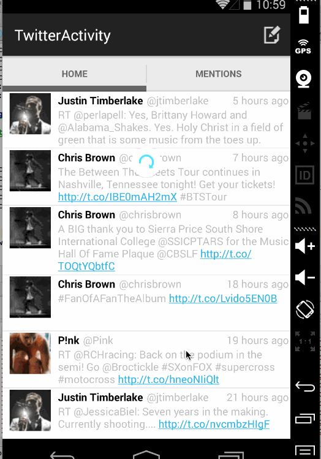

# TwitterClient

## Overview
 This is a simple twitter client.

## Requirements
 * [X] User can sign in to Twitter using OAuth login
 * [X] User can view the tweets from their home timeline
 * [X] User should be displayed the username, name, and body for each tweet
 * [X] User should be displayed the relative timestamp for each tweet "8m", "7h"
 * [X] User can view more tweets as they scroll with infinite pagination
 * [X] Optional: Links in tweets are clickable and will launch the web browser (see autolink)
 * [X] User can compose a new tweet
 * [X] User can click a “Compose” icon in the Action Bar on the top right
 * [X] User can then enter a new tweet and post this to twitter
 * [X] User is taken back to home timeline with new tweet visible in timeline
 * [ ] Optional: User can see a counter with total number of characters left for tweet

 * [X] Advanced: User can refresh tweets timeline by pulling down to refresh (i.e pull-to-refresh)
 * [ ] Advanced: User can open the twitter app offline and see last loaded tweets
 * [X] Advanced: User can tap a tweet to display a "detailed" view of that tweet
 * [X] Advanced: User can share the twitter url from the "detailed" view of that tweet
 * [ ] Advanced: User can select "reply" from detail view to respond to a tweet
 * [ ] Advanced: Improve the user interface and theme the app to feel "twitter branded"
 * [ ] Bonus: User can see embedded image media within the tweet detail view
 * [ ] Bonus: Compose activity is replaced with a modal overlay

## Walkthrough of all user stories:

## Week4. 
 * [X] User can switch between Timeline and Mention views using tabs.
 * [X] User can navigate to view their own profile
 * [X] User can see picture, tagline, # of followers, # of following, and tweets on their profile.
 * [X] User can click on the profile image in any tweet to see another user's profile.
 * [X] User can infinitely paginate any of these timelines (home, mentions, user) by scrolling to the bottom

GIF created with [LiceCap](http://www.cockos.com/licecap/).

